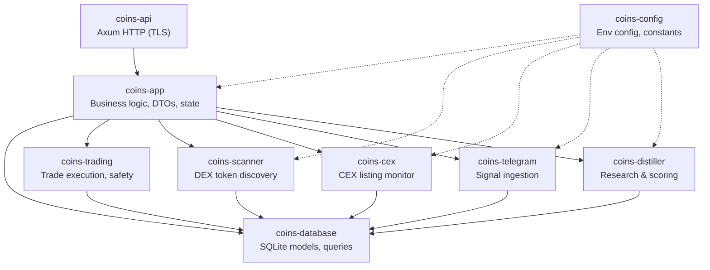

# coins-rust

Solana memecoin trading bot with automated scanning, research, and risk-managed execution.  Mostly a learning project rather than a serious trading platform.

## Architecture



### Crates

| Crate | Path | Role |
|---|---|---|
| `coins-api` | `crates/api/` | Axum HTTP server, routes, request validation, error handling |
| `coins-app` | `crates/app/` | Business logic, DTOs, state, risk/safety orchestration |
| `coins-config` | `crates/core/config/` | Environment-based configuration, constants |
| `coins-database` | `crates/core/database/` | SQLite models, queries, migrations |
| `coins-trading` | `crates/core/trading/` | Trade execution (Jupiter, Pump.fun), safety checks |
| `coins-scanner` | `crates/jobs/scanner/` | DEX token discovery and pool tracking |
| `coins-cex` | `crates/jobs/cex/` | CEX listing monitoring (Binance, Coinbase) |
| `coins-telegram` | `crates/jobs/telegram/` | Telegram signal ingestion |
| `coins-distiller` | `crates/jobs/distiller/` | Token research and safety scoring |

### Safety System

Every trade passes through a pre-flight safety check:

- **Drawdown limits** — blocks new trades and triggers position reduction at configurable thresholds
- **Max positions** — caps open position count
- **Narrative allocation** — limits exposure per narrative cluster
- **Trading mode** — Virtual (paper) vs Real execution, enforced at the check level
- **Position sizing** — validates individual and aggregate position sizes

Endpoints: `GET /safety/check`, `POST /safety/check-trade`

## Prerequisites

- Rust 2024 edition (MSRV matches workspace)
- OpenSSL (for cert generation and TLS)
- SQLite

## Setup

```bash
# Generate TLS certificates for local dev
./scripts/gen-certs.sh

# Configure environment (copy .env or edit directly)
core_database=coins.db
solana_rpc_url=https://api.mainnet-beta.solana.com

# Build
cargo build --release

# Run
cargo run --bin coins-api
```

The server starts on port 3000 (configurable via `host`/`port`).

## Development

```bash
make check     # cargo check
make test      # cargo test
make lint      # cargo clippy
make format    # cargo fmt
make run       # start the API server
```

## Configuration

All configuration is via environment variables (loaded from `.env`):

| Variable | Default | Description |
|---|---|---|
| `core_database` | `coins.db` | SQLite database path |
| `solana_rpc_url` | `https://api.mainnet-beta.solana.com` | Solana RPC endpoint |
| `spike_threshold` | `2.0` | Volume spike detection threshold |
| `baseline_windows` | `6` | Baseline windows for anomaly detection |
| `new_narrative_min_count` | `3` | Min signals to form a new narrative |
| `scanner_poll_interval_secs` | `300` | DEX scanner poll interval |
| `cex_poll_interval_secs` | `300` | CEX listing poll interval |
| `telegram_poll_interval_secs` | `60` | Telegram signal poll interval |
| `distiller_poll_interval_secs` | `300` | Distiller research interval |
| `host` | `0.0.0.0` | API server bind address |
| `port` | `3000` | API server port |
| `tls_cert_path` | — | TLS certificate path |
| `tls_key_path` | — | TLS key path |
